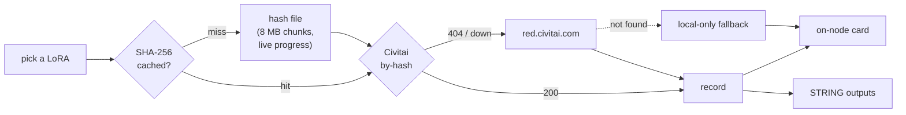
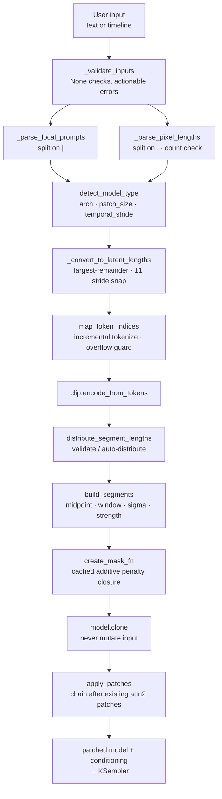

<div align="center">

# 🌀 Winnougan (Nougan's Nodes)


### Custom nodes for [ComfyUI](https://github.com/comfyanonymous/ComfyUI)

**An intuitive Diffusers loader, a workflow‑native image/mask grabber, a one‑toggle Krea 2 uncensor stage with bundled LoRAs, a combined text‑encode + zero‑negative node, a reusable prompt card, a zoom‑proof billboard title, and a themed LoRA loader with favourites, folder filters and a randomizer — all with custom UIs.**

[](https://github.com/comfyanonymous/ComfyUI)
[](https://www.python.org/)
[](#-nodes)
[](#-license)

</div>

---

## ✨ Overview

**Nougan** is a small, focused collection of ComfyUI nodes built for clean workflows and fast iteration:

- 🚀 **Nougan Diffusers Loader** — drop in a Diffusers model *folder* (or single file) and get `MODEL`, `CLIP`, and `VAE` out automatically. Precision is auto‑detected from the files (no weight‑type dropdown). Optionally patch in **SageAttention 2/3** or **FlashAttention 2/3/4** for faster inference.
- 🌀 **Nougan Krea 2 · Uncensored** — a single pipeline stage that **bakes in three bundled uncensored LoRAs**. Toggle 1, 2, or all 3 and set each strength (uncapped). Sits *after* the model and *before* your regular LoRA loader. The LoRAs ship inside the pack, so the workflow is fully portable.
- 🖼️ **Nougan Get Image** — grab an image that's *already in your workflow* (no loading from disk) and split it into `IMAGE` + `MASK`, exactly like the native Load Image node. Includes live in‑node previews.
- 🎯 **Nougan Text Encode + Zero Neg** — one node that encodes your positive prompt **and** builds the negative conditioning (zero‑out *or* empty‑string) in a single step, replacing the classic two‑node chain.
- 📝 **Nougan Text Box** — a clean, save‑safe **prompt card**: type once, emit a `STRING` you can feed any text input (usually a text encoder). Live char / word / line counts, Copy & Clear buttons.
- 🌈 **Nougan Title Font** — a bold, colorful, fully‑styled **banner / title** node with a live preview, 6 styles, glow, 6 animations, color pickers + gradient presets, an optional clickable web link — and it stays a **constant on‑screen size no matter how far you zoom** (a true billboard).
- 📁 **Nougan Lora Loader** *(+ a **Multi‑Model** variant for up to 5 models)* — a themed LoRA **stack editor** with a custom chooser (live search + ☆ favourites), a folder filter, and a 🎲 **randomizer** with per‑line roll / lock / auto‑roll. Outputs `MODEL · CLIP · LORA_STACK` so it chains with the rest of the ecosystem.

All eight nodes ship with a custom, themed frontend UI. The pack also includes a **global Tab‑cycler** quality‑of‑life extension (not a node — see below) that works on *every* node in your graph.

---

## 📦 Nodes

| Node | Category | Outputs | Description |
|------|----------|---------|-------------|
| **Nougan Diffusers Loader 🚀** | `loaders` | `MODEL`, `CLIP`, `VAE` | Intuitively loads a Diffusers model folder or file; optional attention patching. |
| **Nougan Krea 2 · Uncensored 🌀** | `loaders` | `MODEL`, `CLIP`, `applied` | Bakes in 1–3 bundled uncensored LoRAs with per‑LoRA ON/OFF + uncapped strength. |
| **Nougan Get Image 🖼️** | `image` | `IMAGE`, `MASK` | Grabs an in‑workflow image and extracts a mask, with live previews. |
| **Nougan Text Encode + Zero Neg 🎯** | `conditioning` | `POSITIVE`, `NEGATIVE` | Encodes the positive prompt and builds the negative (zero‑out / empty‑string) in one node. |
| **Nougan Text Box 📝** | `utils` | `TEXT` | A reusable, styled prompt card that emits its text as a `STRING`. |
| **Nougan Title Font 🌈** | `utils` | `TEXT` | A zoom‑proof, fully‑styled title banner with optional clickable web link. |
| **Nougan Lora Loader 📁** | `loaders` | `MODEL`, `CLIP`, `lora_stack` | Themed LoRA stack editor: chooser + favourites + folder filter + randomizer. |
| **Nougan Lora Loader (Multi‑Model) 📁** | `loaders` | `MODEL`, `CLIP`, `lora_stack`, `MODEL 2–5` | Same editor, plus up to 4 extra model paths that share the stack. |

---

### 🚀 Nougan Diffusers Loader

Loads a Diffusers model and returns its components. Point it at a model **folder** containing `unet/`, `text_encoder/`, `text_encoder_2/`, and `vae/` subfolders — or at a single unified model file. The node hunts down the right files for you.

**Inputs**

| Name | Type | Description |
|------|------|-------------|
| `model_name` | combo | Any folder or file found in `diffusion_models/`, `unet/`, or `diffusers/`. |
| `sageattention_version` | combo | `None`, `SageAttention 2`, `SageAttention 3`. |
| `flashattention_version` | combo | `None`, `FlashAttention 2`, `FlashAttention 3`, `FlashAttention 4`. |

**Outputs:** `MODEL` · `CLIP` · `VAE`

> 💡 **Precision is auto‑detected** from the model files (bf16 / fp16 / etc.) — there's no weight‑type dropdown to fiddle with.

**Custom UI:** a themed node with a **🔄 Rescan** button and a live, color‑coded **Attention** status badge (🧠 Sage = green, ⚡ Flash = blue, both = pink). The native combo widgets are mirrored into the panel, and the saved selection is the single source of truth — so the chosen model **persists correctly across reloads**.

---

### 🌀 Nougan Krea 2 · Uncensored

A single node that lays down the **uncensoring foundation** for Krea 2 by baking in three small LoRAs that travel *inside* the node pack. It slots into your graph exactly where you'd expect:

```
[ Diffusers / Checkpoint loader ]
        MODEL ──►
        CLIP  ──►│  Nougan Krea 2 · Uncensored   MODEL ──►  [ your LoRA loader ]
                 │     (toggle 1–3 loras)         CLIP  ──►│
                 └────────────────────────────────────────┘
```

**Inputs**

| Name | Type | Description |
|------|------|-------------|
| `model` | `MODEL` | The model to patch (required). |
| `clip` | `CLIP` | Optional — patch the text encoder too when connected. |
| `LoRA 1 / 2 / 3` (ON/OFF) | bool | Preload that bundled LoRA into the model. |
| `LoRA 1 / 2 / 3` strength | float | Per‑LoRA strength. `0` = off. **No upper limit** — `1.0`, `3.0`, `12.5`, whatever you need. |

**Outputs:** `MODEL` · `CLIP` · `applied` (a short text summary of which LoRAs fired, e.g. `Uncensor A@1, Uncensor C@3`).

**Custom UI:** a themed magenta panel, one row per bundled LoRA:
- A clickable **ON/OFF pill** (the strength field greys out when OFF).
- A **presence dot** — 🟢 when the bundled file is found (hover it for the filename + size), 🔴 when it's missing.
- An **uncapped strength** field.

> 🎯 **Why a dedicated node instead of the regular LoRA loader?** The regular loader is a *general tool* ("which of my hundreds of LoRAs?"); this node is a *curated preset* ("give me the proven Krea 2 uncensor foundation, instantly, on any machine"). They're meant to be used **together** — Krea 2 lays the base, your regular loader handles styles/characters/concepts on top. See the [FAQ](#why-use-the-krea-2-node-over-the-regular-lora-loader).

---

### 🖼️ Nougan Get Image

Takes an `IMAGE` that already exists in your graph (from a generator, composite, paste node, etc.) and outputs the image plus a mask — mirroring the native **Load Image** node, but without touching the disk.

**Inputs**

| Name | Type | Default | Description |
|------|------|---------|-------------|
| `image` | `IMAGE` | — | The image to grab from your workflow. |
| `mask_mode` | combo | `Alpha Channel` | `Alpha Channel` (from RGBA), `Luminance` (from brightness), or `Blank` (all‑black). |
| `invert_mask` | bool | `False` | Swap black ↔ white. |
| `mask_threshold` | float | `0.0` | Binarize the mask above this value. `0` = smooth. |

**Outputs:** `IMAGE` · `MASK`

**Mask convention** (matches native Load Image):
- `Alpha Channel` → transparent pixels become **white** (masked out), opaque pixels become **black** (kept).
- No alpha channel → a blank **black** mask (keep everything).

**Custom UI:** side‑by‑side live **Image** and **Mask** thumbnail previews rendered directly inside the node.

---

### 🎯 Nougan Text Encode + Zero Neg

A single ComfyUI node that replaces the classic **`CLIP Text Encode` → `Conditioning Zero Out`** two‑node chain. Feed it a `CLIP` and a positive prompt, and it hands you back **both** conditioning outputs at once — a properly encoded positive *and* a ready‑made negative — so your graph stays clean and you never have to wire up a separate zero‑out node again.

```
        ┌──────────────────────────────────────────┐
  CLIP ─┤  Nougan Text Encode + Zero Neg 🎯        │
        │                                          │
        │  ✍️ Positive Prompt                      │──► POSITIVE  (CONDITIONING)
        │  ┌────────────────────────────────────┐  │
        │  │ a cinematic portrait, golden hour… │  │
        │  └────────────────────────────────────┘  │
        │                                          │
        │  Negative Conditioning                   │
        │  ( ⊘ Zero Out )  ( ∅ Empty String )      │──► NEGATIVE  (CONDITIONING)
        │                                          │
        │  42 chars · 8 words            ● ready   │
        └──────────────────────────────────────────┘
```

| Output | Contents |
|---|---|
| **POSITIVE** | Your prompt text, tokenized and encoded through CLIP (`clip.tokenize` → `encode_from_tokens_scheduled`). |
| **NEGATIVE** | Generated automatically from the mode you pick — **Zero Out** or **Empty String** (below). |

Wire **POSITIVE** → sampler `positive`, **NEGATIVE** → sampler `negative`. Done.

> 🔗 **Plug a Text Box into `positive`** and the panel **greys out + locks**, shows a `🔗 FROM <source>` tag, and previews the incoming text live — so you can always see exactly which string the encoder will use. Unplug and it returns to an editable prompt.

#### The two negative modes — what they actually do

This is the part worth understanding, because the two options are **not** the same thing even though they both mean "no negative prompt."

##### ⊘ Zero Out *(default)*

Takes the positive conditioning and **replaces every value with `0`** — including the `pooled_output` (the global CLIP pooler embedding that SDXL / Flux‑family models carry alongside the token sequence). The tensor keeps the exact same *shape* as the positive (same token length, same hidden dimension); only the numbers become zero.

Mathematically this is a **true null vector** — a signal CLIP itself could never produce. It represents *absolute nothing*, so when classifier‑free guidance runs, the model is pushed maximally "away from the void" and toward your positive prompt.

```
positive embedding : [ 0.42, -1.10,  0.03,  2.71, … ]   ← rich, meaningful
zero‑out negative  : [ 0.00,  0.00,  0.00,  0.00, … ]   ← mathematical zero
```

**Best for:** modern **flow‑matching / rectified‑flow** models — **Flux, Krea 2, Ideogram 4**, and similar — especially when you run them with **CFG > 1**. This matches ComfyUI's built‑in `ConditioningZeroOut` exactly.

##### ∅ Empty String

Encodes the literal text `""` (an empty string) **through CLIP as a normal prompt**. This produces a **real, non‑zero embedding** — CLIP's learned representation of *"no text."* The tokenizer still emits start/end tokens, the transformer layers still run, and the pooler still outputs a genuine (small but non‑zero) vector.

```
positive embedding     : [ 0.42, -1.10,  0.03,  2.71, … ]   ← rich, meaningful
empty‑string negative  : [ 0.05,  0.11, -0.02,  0.09, … ]   ← CLIP's idea of "nothing"
```

That's the key distinction: **`CLIP("")` ≠ `0`**. An empty‑string embedding is *in‑distribution* for the text encoder; a zero vector is not.

**Best for:** models **trained with traditional CFG and blank negatives** — classic **SD 1.5 / SD 2.1 / SDXL** workflows where you'd normally just leave the negative box empty. Feeding those models a real empty‑text embedding keeps you inside the distribution they were trained on.

#### Side‑by‑side

| | **⊘ Zero Out** | **∅ Empty String** |
|---|---|---|
| What it is | Tensor of literal zeros | CLIP encoding of `""` |
| Values | All `0.0` | Small, real, non‑zero |
| `pooled_output` | Zeroed too | Real empty‑text pooler vector |
| In‑distribution for CLIP? | ❌ No (a null CLIP can't produce) | ✅ Yes |
| Ideal models | Flux, Krea 2, Ideogram 4, flow models | SD 1.5 / 2.1 / SDXL, classic CFG |
| Equivalent built‑in node | `ConditioningZeroOut` | `CLIP Text Encode` with `""` |

#### 💡 The CFG = 1 shortcut (why it often doesn't matter)

Classifier‑free guidance combines the two conditionings like this:

```
output = negative + CFG × (positive − negative)
```

Set **CFG = 1.0** and the math collapses:

```
output = negative + 1 × (positive − negative) = positive
```

The negative term **cancels out entirely**. So if you're running a flow model at **CFG 1.0** (the default for Flux / Krea 2 / Ideogram 4), the negative conditioning has **literally zero effect on the image** — the sampler still *requires* the input, but it never uses it. In that case either mode gives identical results; the node simply provides a valid placeholder so the pipeline doesn't error.

The moment you push **CFG above 1**, the negative starts mattering again — and that's when choosing the right mode (usually **Zero Out** for flow models) gives you a cleaner, stronger guidance signal.

#### Which one should I pick?

- **Flux / Krea 2 / Ideogram 4 / any flow‑matching model** → **⊘ Zero Out** (the default).
- **SD 1.5 / SDXL / traditionally‑trained models with a blank negative** → **∅ Empty String**.
- **Running at CFG 1.0?** → Either; it makes no difference. Leave it on Zero Out.
- **Unsure?** → Generate the same seed with both and compare. For most modern models you won't see a difference at CFG 1, and Zero Out is the safe default once you raise CFG.

#### The UI

- A **monospace prompt textarea** with live **character / word count**.
- **Pill‑button toggles** for the negative mode (no fiddly dropdown).
- A small **status dot** that pulses green on every change so you know your edit registered.
- Saved prompt text and mode **restore correctly** on workflow reload.

**Right‑click canvas → Add Node → conditioning → Nougan Text Encode + Zero Neg 🎯**

---

### 📝 Nougan Text Box

A clean, styled **plain‑text** node. You type into it, and it emits your text as a single `STRING` output you can plug into *any* string input — most commonly the **positive** prompt of a text encoder. Think of it as a reusable, save‑safe **prompt card** you can drop anywhere in your graph.

```
  ┌──────────────────────────────┐
  │ 📝  TEXT BOX                 │
  │ ┌──────────────────────────┐ │
  │ │ a cinematic portrait,    │ │
  │ │ golden hour, soft light… │ │
  │ └──────────────────────────┘ │
  │ 42 chars · 8 words · 2 lines │
  │                       ● ⧉   │   ← status · Copy · Clear
  └──────────────┬───────────────┘
            TEXT │  (STRING)  ──►  any STRING input (e.g. an encoder's positive)
```

**Inputs**

| Name | Type | Default | Description |
|------|------|---------|-------------|
| `text` | STRING (multiline) | `""` | Anything you type; emitted verbatim on the `TEXT` output. |

**Outputs:** `TEXT` (`STRING`)

**Custom UI:** an amber note‑card with a resizable monospace editor, live **char / word / line counts**, a **⧉ Copy** button (with a `✓ Copied` confirmation), a **✕ Clear** button, and a status dot that pulses gold on every edit.

> 💡 **Why a separate Text Box?** It *decouples the words from the encoding*: wire **one** Text Box into **several** encoders and edit the prompt once; A/B‑swap prompts by rewiring a single link; rename the node to label your prompt blocks; and **⧉ Copy** grabs exactly what you typed for pasting into a prompt library. The text is the source of truth, so it **saves, restores, and smart‑caches** correctly (it only re‑runs when the text actually changes).

**Right‑click canvas → Add Node → utils → Nougan

---


# Nougan Regional Character LoRA 🎭

> Place two trained character LoRAs into **one** coherent image, each concentrated
> in its own spatial region, **without identity blend** — no compositing, no
> inpainting, no post-processing. The base model still generates a single image
> with full attention across the whole token sequence; this node only injects each
> character LoRA's *activation delta* into the image tokens that fall inside that
> character's region.

---

## Table of Contents

1. [What It Does (30-second version)](#1-what-it-does-30-second-version)
2. [Why Not Just Stack Two LoRAs?](#2-why-not-just-stack-two-loras)
3. [How It Works — The Big Picture](#3-how-it-works--the-big-picture)
4. [The Forward-Time Injection (the key mechanism)](#4-the-forward-time-injection-the-key-mechanism)
5. [Regions — How the Model Knows "Where"](#5-regions--how-the-model-knows-where)
6. [Inputs & Outputs](#6-inputs--outputs)
7. [Wiring Guide (with a real Flux 2 workflow)](#7-wiring-guide-with-a-real-flux-2-workflow)
8. [Token-Space Mechanics (deeper dive)](#8-token-space-mechanics-deeper-dive)
9. [Krea 2 / Flux 2 Architecture Notes](#9-krea-2--flux-2-architecture-notes)
10. [Debugging — "It Sometimes Makes Mistakes"](#10-debugging--it-sometimes-makes-mistakes)
11. [The Recon Tool](#11-the-recon-tool)
12. [FAQ / Troubleshooting](#12-faq--troubleshooting)

---

## 1. What It Does (30-second version)

You have two character LoRAs (say, **Character A** and **Character B**). You want
both characters in the same image — A on the left, B on the right — each looking
like *themselves*, not a blend of both.

This node makes that happen by **masking each LoRA's influence to a spatial
region** of the image, at the level of individual attention tokens, during the
model's forward pass. The model still "sees" the whole image with full attention;
only the *LoRA deltas* are region-gated.

```
┌─────────────────────────────────────────────────┐
│              GENERATED IMAGE                     │
│                                                  │
│   ┌──────────────┐    ┌──────────────┐          │
│   │  REGION A    │    │  REGION B    │          │
│   │  (LoRA A     │    │  (LoRA B     │          │
│   │   active)    │    │   active)    │          │
│   │              │    │              │          │
│   │  Character A │    │  Character B │          │
│   │  appears here│    │  appears here│          │
│   └──────────────┘    └──────────────┘          │
│                                                  │
│   ← LoRA A's delta    LoRA B's delta →          │
│     only reaches        only reaches             │
│     these tokens        these tokens             │
└─────────────────────────────────────────────────┘
```

---

## 2. Why Not Just Stack Two LoRAs?

A normal LoRA load **merges** a low-rank weight delta into the model **globally**:

```
W_effective = W_base + strength × (up @ down)
```

Every pixel carries **both** identities → **blend**. Character A gets B's features
and vice versa. The more LoRAs you stack, the more they interfere.

This node **never merges**. The deltas are added at forward time and **masked to a
token region**, so identity A only reaches region A's tokens:

```
                    ┌─────────────────────────────────────┐
  NORMAL STACK:     │  W' = W + ΔA + ΔB   (everywhere)    │  → BLEND
                    └─────────────────────────────────────┘

                    ┌─────────────────────────────────────┐
  THIS NODE:        │  tokens in A:  out += mask_A × ΔA   │  → CLEAN
                    │  tokens in B:  out += mask_B × ΔB   │  → CLEAN
                    │  (ΔA and ΔB never touch each other) │
                    └─────────────────────────────────────┘
```

---

## 3. How It Works — The Big Picture

```
                         ┌──────────────────┐
                         │   UNETLoader /   │
                         │   Diffusers      │
                         │   Loader         │
                         └────────┬─────────┘
                                  │ MODEL
                                  ▼
                    ┌─────────────────────────────┐
                    │  Nougan Krea 2 · Uncensored │  ← optional base LoRAs
                    └─────────────┬───────────────┘
                                  │ MODEL
                                  ▼
                    ┌─────────────────────────────┐
                    │  Your LoRA Loader           │  ← style / global LoRAs
                    │  (Fantastic / native)       │
                    └─────────────┬───────────────┘
                                  │ MODEL
                                  ▼
              ┌───────────────────────────────────────┐
              │                                       │
              │   NOUGAN REGIONAL CHARACTER LORA 🎭   │  ← THIS NODE
              │                                       │
              │   lora_a ──► Region A tokens          │
              │   lora_b ──► Region B tokens          │
              │   regions ──► visual editor (manual)  │
              │                                       │
              └───────────────────┬───────────────────┘
                                  │ MODEL (patched)
                                  ▼
                    ┌─────────────────────────────┐
                    │  BasicGuider / KSampler     │
                    └─────────────┬───────────────┘
                                  │
                                  ▼
                    ┌─────────────────────────────┐
                    │  VAEDecode → SaveImage      │
                    └─────────────────────────────┘
```

The node sits **after** your model loaders and global LoRAs, and **before** the
sampler. It returns a patched `MODEL` — the base weights are untouched; the
regional deltas are applied via forward hooks at inference time.

---

## 4. The Forward-Time Injection (the key mechanism)

This is the part worth understanding, because it's what makes regional LoRA
possible without compositing.

### Step by step

```
 1. LOAD PHASE (once, when the node runs)
 ─────────────────────────────────────────
    lora_a.safetensors ──► { module_sig: {down, up, scale} }
    lora_b.safetensors ──► { module_sig: {down, up, scale} }

    Match each LoRA's target modules to the live model's Linear layers
    by normalised name (collapses _ vs ., strips prefixes).

    Result: layer_map = {
      "blocks.0.attn.wq": (module, {a: {...}, b: {...}}),
      "blocks.0.attn.wk": (module, {a: {...}, b: {...}}),
      ...
    }


 2. PREPARE PHASE (once, on first forward call)
 ──────────────────────────────────────────────
    Read the latent shape → compute token grid (rows × cols)
    Build mask_A and mask_B over the token grid
    Move LoRA matrices + masks to GPU in compute dtype (bf16/fp32)


 3. FORWARD PHASE (every diffusion step, every layer)
 ────────────────────────────────────────────────────
    For each matched Linear layer, a forward hook fires:

    ┌─────────────────────────────────────────────────────────┐
    │  hook(module, input, output):                           │
    │                                                         │
    │    x = input[0]              # [batch, seq, dim]        │
    │                                                         │
    │    # LoRA A's delta, masked to region A                 │
    │    Δa = (x @ down_aᵀ) @ up_aᵀ                          │
    │    res = mask_A × Δa         # zero outside region A    │
    │                                                         │
    │    # LoRA B's delta, masked to region B                 │
    │    Δb = (x @ down_bᵀ) @ up_bᵀ                          │
    │    res += mask_B × Δb        # zero outside region B    │
    │                                                         │
    │    return output + res       # add to layer output      │
    └─────────────────────────────────────────────────────────┘

    The base model's own weights are NEVER modified.
    The hooks are registered before each forward call and
    removed immediately after — no leakage between steps.
```

### Why this avoids blend

```
  Token in Region A:     mask_A = 1.0,  mask_B = 0.0
                         → gets Δa only → Character A's identity

  Token in Region B:     mask_A = 0.0,  mask_B = 1.0
                         → gets Δb only → Character B's identity

  Token on the seam:     mask_A = 0.6,  mask_B = 0.4  (feathered)
                         → gets a soft mix → smooth transition

  Text tokens:           mask_A = 0.0,  mask_B = 0.0
                         → no LoRA delta → prompt conditioning unchanged
```

---

## 5. Regions — How the Model Knows "Where"

### The token grid

The model doesn't work in pixels — it works in **tokens**. For Krea 2 / Flux 2:

```
  Original image:  1248 × 832 pixels
                         │
                    VAE encode (÷8)
                         │
                         ▼
  Latent:           156 × 104
                         │
                    Patchify (÷2)
                         │
                         ▼
  Token grid:        78 × 52  =  4,056 image tokens
```

Each token corresponds to a 16×16 pixel patch of the original image. The region
masks are built on this token grid, not on pixels.

### Split modes

The node supports five ways to define regions:

| Mode | What it does | When to use |
|---|---|---|
| **`manual`** | You draw boxes in the on-node visual editor | Precise control over character placement |
| **`auto`** | Picks vertical (L/R) for portrait/square, horizontal (T/B) for landscape | Quick test, no fiddling |
| **`vertical_auto`** | Always splits left / right | Two characters side by side |
| **`horizontal_auto`** | Always splits top / bottom | Two characters stacked |
| **`bbox`** | Reads boxes from a KJ BoundingBox wire | Programmatic / animated placement |

### Visual: split modes

```
  vertical_auto (L/R)          horizontal_auto (T/B)         manual (custom)
  ┌─────────┬─────────┐       ┌───────────────────┐          ┌───────────────────┐
  │         │         │       │                   │          │                   │
  │  A      │      B  │       │        A          │          │    ┌───┐          │
  │         │         │       │                   │          │    │ A │    ┌───┐ │
  │         │         │       ├───────────────────┤          │    └───┘    │ B │ │
  │         │         │       │                   │          │             └───┘ │
  │         │         │       │        B          │          │                   │
  └─────────┴─────────┘       │                   │          └───────────────────┘
   mask_A ←──→ mask_B         └───────────────────┘           boxes from editor
   (smooth ramp at seam)       mask_A ↑↓ mask_B
```

### The visual editor (manual mode)

When `split_mode = manual`, the node shows a canvas editor with two
draggable/resizable boxes:

- **Blue box** = Region A (lora_a)
- **Red box** = Region B (lora_b)
- Drag to move, drag the corner handle to resize
- Coordinates are normalised (0–1) and stored in the `regions` widget as JSON
- The editor is **cosmetic** — it shows your intent; the actual masking happens
  in token space at execution time

---

## 6. Inputs & Outputs

### Inputs

| Name | Type | Required | Description |
|---|---|---|---|
| `model` | `MODEL` | ✅ | The model to patch (after loaders / global LoRAs) |
| `lora_a` | combo | ✅ | Character A's LoRA file (from `models/loras/`) |
| `strength_a` | `FLOAT` | ✅ | LoRA A strength (`-4.0` to `4.0`, default `1.0`) |
| `lora_b` | combo | ✅ | Character B's LoRA file |
| `strength_b` | `FLOAT` | ✅ | LoRA B strength |
| `split_mode` | combo | ✅ | `manual` / `auto` / `vertical_auto` / `horizontal_auto` / `bbox` |
| `seam_feather` | `FLOAT` | ✅ | Softness of the region boundary (`0.0`–`0.3`, default `0.08`) |
| `blend_override` | `FLOAT` | ✅ | `0` = pure regional, `1` = both at 0.5 everywhere (controlled merge) |
| `compute_precision` | combo | ✅ | `bf16 (fast)` or `fp32 (precise)` |
| `regions` | `STRING` | optional | Managed by the visual editor (JSON of box coords) |
| `bboxes` | `BOUNDINGBOX` | optional | KJ BoundingBox wire (for `bbox` mode) |
| `mask_a` | `MASK` | optional | Painted mask override for region A |
| `mask_b` | `MASK` | optional | Painted mask override for region B |
| `debug` | `BOOLEAN` | optional | Print extra per-run diagnostics |

### Outputs

| Name | Type | Description |
|---|---|---|
| `MODEL` | `MODEL` | The patched model (base weights untouched, hooks applied at forward time) |

---

## 7. Wiring Guide (with a real Flux 2 workflow)

Here's how the node fits into a typical Krea 2 / Flux 2 editing pipeline:

```
  ┌────────────┐     ┌──────────────────┐     ┌────────────────────┐
  │ UNETLoader │────►│ Krea 2 Uncensored│────►│ LoraLoaderModelOnly│
  │ (flux2-dev)│     │ (base LoRAs)     │     │ (turbo / style)    │
  └────────────┘     └──────────────────┘     └─────────┬──────────┘
                                                        │ MODEL
                                                        ▼
  ┌────────────┐     ┌──────────────────┐     ┌────────────────────┐
  │ CLIPLoader │────►│ CLIPTextEncode   │────►│ FluxGuidance       │
  │ (mistral)  │     │ (your prompt)    │     │ (guidance = 4)     │
  └────────────┘     └──────────────────┘     └─────────┬──────────┘
                                                        │ CONDITIONING
                                                        ▼
  ┌────────────┐     ┌──────────────────┐     ┌────────────────────┐
  │ MaskEditor │────►│ ImageScale       │────►│ VAEEncode          │
  │ (paint     │     │ (to 1 MP)        │     │                    │
  │  mask)     │     └────────┬─────────┘     └─────────┬──────────┘
  └─────┬──────┘              │                         │ LATENT
        │                     ▼                         ▼
        │            ┌──────────────────┐     ┌────────────────────┐
        │            │ GetImageSize     │────►│ ReferenceLatent    │
        │            │ (→ scheduler,    │     │ (conditioning +    │
        │            │  empty latent)   │     │  reference latent) │
        │            └──────────────────┘     └─────────┬──────────┘
        │                                              │ CONDITIONING
        │                                              ▼
        │            ┌──────────────────────────────────────────────┐
        │            │                                              │
        │            │   NOUGAN REGIONAL CHARACTER LORA 🎭          │
        │            │                                              │
        │            │   model ◄──── from LoraLoaderModelOnly       │
        │            │   lora_a = "character_a.safetensors"         │
        │            │   lora_b = "character_b.safetensors"         │
        │            │   split_mode = "manual"                      │
        │            │   regions ◄──── (visual editor)              │
        │            │                                              │
        │            └──────────────────┬───────────────────────────┘
        │                               │ MODEL (patched)
        │                               ▼
        │            ┌──────────────────────────────────────────────┐
        │            │  BasicGuider ← model + conditioning          │
        │            └──────────────────┬───────────────────────────┘
        │                               │ GUIDER
        │                               ▼
        │            ┌──────────────────────────────────────────────┐
        │            │  SamplerCustomAdvanced                       │
        │            │  (noise + guider + sampler + sigmas + latent)│
        │            └──────────────────┬───────────────────────────┘
        │                               │ LATENT
        │                               ▼
        │            ┌──────────────────────────────────────────────┐
        │            │  VAEDecode → NouganMaskComposite → SaveImage │
        │            └──────────────────────────────────────────────┘
        │
        └──► MASK ──► NouganMaskComposite (for edit-then-composite)
```

### Key wiring rules

1. **Regional LoRA goes AFTER all global LoRAs** — it patches the model that
   already has your style/turbo/uncensor LoRAs baked in.
2. **Regional LoRA goes BEFORE the sampler** — it returns a patched `MODEL`
   that the guider/sampler consumes.
3. **The `regions` widget is managed by the visual editor** — you don't type
   JSON by hand (unless you want to).
4. **`mask_a` / `mask_b` sockets override the editor** — if you wire a painted
   mask in, it takes priority over the box-based regions.

---

## 8. Token-Space Mechanics (deeper dive)

### How pixel boxes become token masks

```
  Editor box (normalised):          Token grid (78 × 52):
  ┌───────────────────────┐         ┌───────────────────────┐
  │ x=0.0  y=0.0         │         │ 0 0 0 ... 0 │ 0 0 0  │
  │ w=0.5  h=1.0         │  ───►   │ 0 0 0 ... 0 │ 0 0 0  │
  │                       │         │ . . .       │ . . .  │
  │ (left half)           │         │ 1 1 1 ... 0 │ 0 0 0  │
  │                       │         │ 1 1 1 ... 0 │ 0 0 0  │
  └───────────────────────┘         └───────────────────────┘
                                     ▲ mask_A = 1 inside box
                                     ▲ mask_B = 1 - mask_A (complement)
```

The conversion:
1. Normalised coords `(x, y, w, h)` → token-grid coords `(x×cols, y×rows, ...)`
2. A **sigmoid ramp** at the box edges creates a soft feather (controlled by
   `seam_feather`)
3. The mask is flattened row-major to match the image-token order in the sequence

### The text/image token split

The model's sequence is `[text tokens | image tokens]`:

```
  ┌──────────────────────────────────────────────────────────────┐
  │  text tokens (prompt)  │  image tokens (latent grid)        │
  │  ← mask = 0 (no LoRA) │  ← mask = region value             │
  │                        │                                    │
  │  n_text tokens         │  n_img = rows × cols tokens        │
  └──────────────────────────────────────────────────────────────┘
                           ▲
                           │
                    seq - n_img = n_text
```

The node measures `n_img` from the latent shape at runtime and places the region
mask on the **trailing** `n_img` tokens. Text tokens always get mask = 0, so the
LoRA deltas never touch the prompt conditioning.

### Feathering

`seam_feather` controls how soft the boundary between regions is:

```
  feather = 0.0 (hard)          feather = 0.08 (default)       feather = 0.2 (soft)
  ┌──────┬──────┐               ┌──────┬──────┐                ┌──────┬──────┐
  │ A=1  │ B=1  │               │ A=1  │░░░░░░│                │ A=1  │▒▒▒▒▒▒│
  │ A=1  │ B=1  │               │ A=1  │░░░░░░│                │ A=1  │▒▒▒▒▒▒│
  │ A=1  │ B=1  │               │ A=1  │░░░░░░│                │ A=1  │▒▒▒▒▒▒│
  └──────┴──────┘               └──────┴──────┘                └──────┴──────┘
  abrupt seam                   smooth transition              very wide blend
  (visible line)                (natural)                      (characters merge)
```

### Blend override

`blend_override` mixes between pure regional and a controlled global merge:

```
  blend = 0.0                   blend = 0.5                    blend = 1.0
  ┌──────┬──────┐               ┌──────┬──────┐                ┌──────┬──────┐
  │ A=1  │ A=0  │               │ A=.75│ A=.25│                │ A=.5 │ A=.5 │
  │ B=0  │ B=1  │               │ B=.25│ B=.75│                │ B=.5 │ B=.5 │
  └──────┴──────┘               └──────┴──────┘                └──────┴──────┘
  pure regional                 partial merge                  both everywhere
  (no cross-contamination)      (slight blend at seam)         (same as stacking)
```

---

## 9. Krea 2 / Flux 2 Architecture Notes

These are the architectural facts that determine whether the regional patch works
correctly. They were confirmed via `recon_krea2.py` and the session's own logs.

### Attention projections: SEPARATE (not fused)

```
  Krea 2 / Flux 2 image transformer block:
  ┌─────────────────────────────────────────────────┐
  │  blocks.N.attn.wq    ← separate Q projection    │
  │  blocks.N.attn.wk    ← separate K projection    │
  │  blocks.N.attn.wv    ← separate V projection    │
  │  blocks.N.attn.wo    ← separate output proj     │
  │  blocks.N.mlp.gate   ← MLP gate                 │
  │  blocks.N.mlp.up     ← MLP up                   │
  │  blocks.N.mlp.down   ← MLP down                 │
  └─────────────────────────────────────────────────┘
```

This means the node patches **whatever Linear the LoRA actually targets** — it
doesn't assume fused qkv. If your LoRA targets `wq` and `wk`, those are the only
layers that get hooks.

### The txtfusion branch

Krea 2's character/refusal LoRAs (like the CivitAI TextFusion Refusal-Reduction
LoRA) target a **separate conditioning pathway**:

```
  Qwen-VL text encoder
         │
         │  hidden-state taps
         ▼
  ┌─────────────────────────────────────┐
  │  txtfusion.layerwise_blocks.0       │  ← LoRA targets here
  │  txtfusion.layerwise_blocks.1       │  ← LoRA targets here
  │  txtfusion.refiner_blocks.0         │  ← LoRA targets here
  │  txtfusion.refiner_blocks.1         │  ← LoRA targets here
  └──────────────────┬──────────────────┘
                     │  conditioning
                     ▼
  ┌─────────────────────────────────────┐
  │  Image transformer (blocks.0..N)    │  ← character LoRAs target here
  └─────────────────────────────────────┘
```

**Important:** if your character LoRAs target the image transformer blocks
(`blocks.N.attn.*`), the regional masking works as described. If they target
`txtfusion.*` instead, the regional mask still applies, but the effect is on the
*conditioning pathway* rather than the image tokens directly — which may produce
different (less spatially precise) results.

### LoRA key naming

The node normalises LoRA keys and model module names to a common signature:

```
  LoRA key:    lora_unet_blocks_0_attn_wq.lora_down.weight
               ─────────────────────────────────────────────
               strip prefix → "blocks_0_attn_wq.lora_down.weight"
               strip suffix → "blocks_0_attn_wq"
               collapse _/. → "blocks0attnwq"

  Model name:  blocks.0.attn.wq
               ─────────────────
               collapse _/. → "blocks0attnwq"

  Match! ✓
```

---

## 10. Debugging — "It Sometimes Makes Mistakes"

The most common causes of intermittent issues, ranked by likelihood:

### Diagnostic checklist

| # | Symptom | Likely cause | Fix |
|---|---|---|---|
| 1 | Character appears in the **wrong region** | Token offset mismatch — the text/image boundary is wrong for your model | Run the recon runtime snippet; check the `[NouganRegionalLoRA] forward: seq=… n_text=… n_img=…` print |
| 2 | Characters **blend** despite clean boxes | `blend_override` > 0, or `seam_feather` too high | Set `blend_override = 0`, reduce `seam_feather` to `0.04` |
| 3 | Character is **weak or inconsistent** | Few layers matched — LoRA key stems don't normalise-match the model | Check the `matched N layers` print; run `recon_krea2.py` to compare LoRA stems vs model keys |
| 4 | **No effect at all** | 0 layers matched, or LoRA file not found | Check console for `!! 0 layers matched` or file-not-found warnings |
| 5 | Character looks **slightly off / noisy** | bf16 precision loss on small deltas | Switch `compute_precision` to `fp32 (precise)` |
| 6 | **Hard visible seam** between regions | `seam_feather = 0` | Increase to `0.06`–`0.12` |
| 7 | Whole image changes, not just the region | `mask_a`/`mask_b` wired but covering the full frame, or `regions` JSON is empty/corrupt | Check the visual editor; verify boxes are drawn |

### Console prints to watch

When you queue a generation, the node prints diagnostic lines:

```
[NouganRegionalLoRA] matched 128 layers (A:64 B:64 targets in file).
[NouganRegionalLoRA] prepared on cuda:0 | latent=(1, 16, 104, 156) grid=52x78 (latent) n_img=4056 split=manual
[NouganRegionalLoRA] forward: seq=4312  n_text=256  n_img=4056 (grid 52x78, latent)  split=manual  dtype=torch.bfloat16
```

**What to check:**
- `matched N layers` — should be > 0, ideally close to the LoRA's target count
- `n_img` — should equal `rows × cols` from the grid
- `n_text` — should be a positive number (the text encoder's token count)
- If you see `!! n_img does not fit in seq` — the trailing-image assumption is
  wrong for your model; report the `seq` and `n_img` values

---

## 11. The Recon Tool

`recon_krea2.py` is a **CPU-only diagnostic** that parses safetensors headers
(no tensor loading, no GPU needed). Run it before first use to confirm your
LoRA and model are compatible:

```bash
cd <ComfyUI root>
python_embeded\python.exe custom_nodes\Nougan\recon_krea2.py ^
    --unet "models\unet\krea2TurboOfficialComfy_krea2TurboFp8.safetensors" ^
    --lora "models\loras\your_character_lora.safetensors"
```

It answers three questions:

| Question | What it tells you | Why it matters |
|---|---|---|
| **Q1** | Fused qkv vs separate q/k/v, + MLP presence | Determines which Linear layers get hooks |
| **Q2** | Standard LoRA vs LoHa (LyCORIS) | LoHa needs special handling; standard up@down works |
| **Q3** | LoRA key naming convention | Must normalise-match the model's module names |

The script also prints a **runtime snippet** you can paste into the node wrapper
to measure the live `x.shape` / `context.shape` during a generation — this
confirms the text/image token split for your specific model.

---

## 12. FAQ / Troubleshooting

**Q: Does this modify my base model?**
No. The base weights are never touched. LoRA deltas are added via forward hooks
at inference time and removed after each forward call.

**Q: Can I use more than 2 characters?**
Not with this node as-is — it's designed for exactly 2 regions (A and B). For
more characters, you'd need to extend the hook to handle N masks.

**Q: Does it work with inpainting / compositing?**
It's designed to work *without* compositing — the regional masking happens inside
the model's forward pass. But you can still use the `NouganMaskComposite` node
downstream for edit-then-composite workflows (e.g., masking a Flux 2 edit to a
painted region).

**Q: Why does the visual editor show a portrait aspect ratio?**
The editor canvas is cosmetic — it shows your box layout in a fixed preview
aspect. The actual masking uses the real latent dimensions at execution time, so
the boxes map correctly regardless of the preview shape.

**Q: The `regions` widget shows a long JSON string. Should I edit it?**
No — it's managed by the visual editor. If you need to reset it, delete the node
and re-add it, or switch `split_mode` away from `manual` and back.

**Q: Can I use painted masks instead of boxes?**
Yes. Wire a `MASK` into the `mask_a` and/or `mask_b` sockets. Painted masks
**always override** the box-based regions, regardless of `split_mode`.

**Q: What does `blend_override` actually do?**
It interpolates between pure regional masking (`0`) and a uniform 50/50 mix
(`1`). At `0`, each region gets only its own LoRA. At `1`, every token gets both
LoRAs at half strength (equivalent to a normal stack). Values in between give a
controlled partial blend. Default is `0` (pure regional).

**Q: The node prints `!! 0 layers matched`. What now?**
Your LoRA's key stems don't match the model's module names after normalisation.
Run `recon_krea2.py` with both `--unet` and `--lora` and compare the printed
stems. Common causes: the LoRA was trained for a different model architecture,
or it uses a non-standard key prefix.

**Q: Does `compute_precision` matter?**
For most use cases, `bf16 (fast)` is fine. If you notice subtle fidelity issues
(character looks slightly different from a global-LoRA reference), switch to
`fp32 (precise)`. The difference is in the matmul precision of the LoRA deltas,
which accumulate across many layers.

---

*Part of the **Nougan** node suite — Diffusers Loader 🚀 · Krea 2 Loader 🌀 ·
Get Image 🖼️ · Text Encode + Zero Neg 🎯 · Text Box 📝 · Title Font 🌈 ·
Mask Editor 🎨 · Mask Composite 🎭 · Regional Character LoRA 🎭*

---

# Nougan Lora Inspector 🔍


```
┌ NOUGAN · LORA INSPECTOR ──────────── hashing ▓▓▓▓▓░░ 62% ┐
│  Detail Additions            v2.0 · LORA · SafeTensor     │
│  TRIGGER WORDS   [ detail additions ]        [copy all]   │
│  FOR  ▮ Flux.2 ▮                                          │
│  ‹ [img] [img] [img] [img] [img] ›   ← click = copy prompt│
│  ⬇ 48,201   ★ 4.87   228 MB        civitai.com  open ↗   │
└───────────────────────────────────────────────────────────┘
```

**Point at a LoRA. It identifies itself.** Base model (Flux 2, Krea 2, LTXV, Pony…), trigger words, sample images, stats — pulled live from Civitai and rendered right on the node. No queue, no browser, no copy-paste archaeology through model pages.

`civitai.com` first, automatic fallback to `red.civitai.com`. Zero pip dependencies.

---

## At a glance

| | |
|---|---|
| **Node** | `Nougan Lora Inspector 🔍` (category `nougan`) |
| **Inputs** | none — everything is an on-node widget |
| **Outputs** | `model_name` · `base_model` · `trigger_words` · `metadata_json` (all `STRING`) |
| **Runs when** | you pick a LoRA, press **inspect**, or queue the prompt |
| **Needs** | nothing (API key optional, recommended) |

## Features

- 🔁 **No Queue required** — selecting a LoRA auto-inspects it (~0.4 s debounce); the **inspect** button re-runs, **↻** force-refreshes bypassing all caches.
- 🖼️ **Sample strip** — every image from the Civitai record, snap-scrolling left→right (arrows, trackpad, or mouse wheel).
- 📋 **Click an image → copies its positive prompt.** Green "prompt copied ✓" flash; amber "no prompt" if the image has no generation data — clipboard untouched.
- 🏷️ **Trigger words up top** — click a chip to copy it, or **copy all** for the comma-separated list.
- 🧬 **Base-model badge** — color-coded per architecture family so you know at a glance if a LoRA fits your checkpoint.
- 📊 **Stats & provenance** — downloads, rating, file size, format, SHA-256, and an `open ↗` link to the Civitai page.
- 🛟 **Graceful fallback** — hash not on Civitai (self-trained LoRAs) or network down? You still get local Kohya `ss_*` metadata from the safetensors header, flagged `local only`. The graph never crashes.
- 💾 **Persistent** — the card is stored in the workflow and re-renders on load; hashes and Civitai records are cached to disk.

## How it works



## Install

Already part of the **Nougan suite** — nothing extra to do:

1. Update the suite (`git pull` or re-copy).
2. Restart ComfyUI (the web extension loads at startup).
3. Confirm the console shows `[Nougan] ✅ Lora Inspector loaded.`

Files it adds:

```
your-suite/
├── __init__.py                      ← registers the node in its own try/except
├── nougan_lora_inspector.py         ← node + /nougan/lora_inspector/inspect route
├── web/nougan-lora_inspector.js     ← panel, progress bar, sample strip
├── cache/lora_inspector_cache.json  ← created automatically
└── civitai_api_key.txt              ← optional, see below
```

> The node lives in its own `try/except` block — even if it fails to load, the core suite and every other optional node keep working.

## Usage

1. **Add Node → nougan → Nougan Lora Inspector 🔍**
2. Pick any LoRA from `models/loras` in the dropdown — it inspects itself immediately.
3. Read the card: trigger words, base model, samples, stats.
4. **Click a sample image** to copy the exact prompt that generated it.
5. Optionally wire the string outputs into prompt builders / text nodes — or leave them dangling; the node executes either way.

| Control | Action |
|---|---|
| LoRA dropdown | auto-inspects on change |
| **inspect** | manual lookup (uses cache) |
| **↻** | force refresh — re-hash + re-fetch, ignoring cache |
| sample image | copy that image's positive prompt |
| trigger chip | copy one trigger word |
| **copy all** | copy all trigger words, comma-separated |
| ‹ › / wheel | scroll the sample strip |
| `open ↗` | open the Civitai page |

## API key (optional)

Unauthenticated requests work, but a key gets you higher rate limits and full NSFW records. Resolution order:

1. The node's `api_key` widget
2. `CIVITAI_API_TOKEN` (or `CIVITAI_API_KEY`) environment variable
3. `civitai_api_key.txt` in the suite root — one line, just the token

Get a token from [civitai.com → Account Settings → API Keys](https://civitai.com/user/account).

## Caching

| What | Where | Bypass |
|---|---|---|
| SHA-256 per file (keyed by path + mtime + size) | `cache/lora_inspector_cache.json` | **↻** |
| Civitai record per hash | same file | **↻** |

First hash of a ~200 MB LoRA takes a few seconds; every lookup after that is near-instant. Delete the cache file for a clean slate.

## For scripters — HTTP endpoint

The node's button talks to a plain endpoint you can call from anything:

```
GET /nougan/lora_inspector/inspect
```

| Param | Required | Description |
|---|---|---|
| `lora` | ✅ | filename inside `models/loras` |
| `source` | | `auto` (default) · `civitai.com` · `red.civitai.com` |
| `api_key` | | bearer token override |
| `node` | | node id — websocket progress events target it |
| `force` | | `1` to bypass caches |

```bash
curl "http://127.0.0.1:8188/nougan/lora_inspector/inspect?lora=my_lora.safetensors&node=12"
```

Returns the full payload (`model_name`, `base_model`, `trigger_words`, `images[]` with per-image `meta`, `stats`, …). Progress streams over the websocket as `nougan_lora_inspector/progress`, `…/metadata`, and `…/error` events.

## Troubleshooting

| Symptom | Fix |
|---|---|
| Card says `local only` | Hash isn't on Civitai (self-trained / renamed files) — local safetensors metadata is still shown |
| `auth rejected (401/403)` | Bad or expired API key — see resolution order above |
| Panel never appears | Check console for `[Nougan] ⚠️ Lora Inspector NOT loaded …` and restart ComfyUI |
| Stale record after re-uploading | Press **↻**, or delete `cache/lora_inspector_cache.json` |
| Sample images blank | Civitai CDN hiccup / hotlink block — broken frames hide themselves; the rest of the card is unaffected |
| `.ckpt` LoRA | Hashing + Civitai lookup work; there's no safetensors header, so local metadata is empty |

---

*Queries the public [Civitai API](https://github.com/civitai/civitai/wiki/REST-API-Reference) (`/api/v1/model-versions/by-hash/{sha256}`). Not affiliated with Civitai. Part of the Nougan node suite.*
---
<div align="center">

# 🎬 Nougan Prompt Relay


**Temporal local-prompt control for LTX Video · LTX2 · LTXAV**

A ground-up rewrite of Kijai's Prompt Relay — with a visual timeline editor, token-overflow safety, non-destructive model patching, and per-stream audio tuning.


</div>

---

## What it does

Prompt Relay conditions **different time segments of a video with different prompts**, while one global prompt anchors the whole scene. It injects a Gaussian temporal penalty into cross-attention so segment A's tokens are suppressed when the model attends from segment B's frames — producing smooth, text-driven scene transitions with no keyframes, no ControlNet, no img2img chains.

```
GLOBAL:  "cinematic, 35mm film, a red fox"

  0s ──────── 2s ──────── 4s ──────── 5.4s
  ┌───────────┬───────────┬───────────┐
  │ trots     │ pauses at │ vanishes  │
  │ through   │ the edge  │ into      │
  │ snowfall  │ of a lake │ morning   │
  │           │           │ mist      │
  └───────────┴───────────┴───────────┘
   segment 1    segment 2   segment 3
```

One latent. One sampler pass. Three distinct scenes, blended where you want them blended.

---

## ✨ Why this fork

Kijai's original introduced Prompt Relay to ComfyUI. This is a full rewrite of every layer — tokenization, segment math, penalty construction, model patching, and the UI — fixing correctness bugs and adding what was missing.

| Area | Kijai's original | Nougan Prompt Relay |
|---|---|---|
| **Token overflow** | Silent truncation; mask indices desync from real tokens | Detected, warned, clamped; ranges remapped to the live window |
| **Segment midpoint** | Integer division, biases left on even-length segments | True float centre |
| **Penalty cache** | Key omits `dtype` → redundant casts in mixed precision | Key includes `dtype` → zero casts after first build |
| **Penalty math** | Per-segment Python loop | Vectorised broadcast, single pass |
| **Full-coverage snap** | Hijacks intentionally partial timelines | Snaps only within ±1 temporal stride of full extent |
| **Model patching** | Replaces attn2 forward, discarding prior patches | Wraps & chains after KJNodes NAG, custom CFG, etc. |
| **CFG batching** | Mask can leak into the unconditional branch | Explicit `cond_or_uncond` guard, documented behaviour |
| **Audio stream** | Not handled | LTXAV `audio_attn2` patched with independent knobs |
| **Tokenizer extraction** | Pure reflection, breaks on refactors | Fast paths for known wrappers + reflective fallback |
| **Options** | Raw `dict` — typos silently become defaults | Typed `RelayOptionsData` with validation |
| **Per-segment epsilon** | Single global value | Optional per-segment override list |
| **Zero-length segments** | Cursor stalls, segments overlap | Warned and cleanly skipped |
| **Pipeline** | Monolithic function | Decomposed, unit-testable stages |
| **Interface** | Two text fields | WYSIWYG timeline editor |
| **Advanced tuning** | None | Dedicated options node |
| **Suite isolation** | Standalone pack | `try/except` — never takes down sibling nodes |

---

## 📖 Table of Contents

- [What it does](#what-it-does)
- [Why this fork](#-why-this-fork)
- [Installation](#-installation)
- [Quick start](#-quick-start)
- [The timeline editor](#-the-timeline-editor)
- [Node reference](#-node-reference)
- [Advanced options](#-advanced-options)
- [Epsilon cheat sheet](#-epsilon-cheat-sheet)
- [Technical deep dives](#-technical-deep-dives)
- [Architecture](#-architecture)
- [Troubleshooting](#-troubleshooting)
- [Credits](#-credits)

---

## 📦 Installation

Part of the Nougan suite. Drop the pack into `ComfyUI/custom_nodes/` and restart.

```bash
cd ComfyUI/custom_nodes
git clone <your-repo-url>
# restart ComfyUI
```

On success the console prints:

```
[Nougan] ✅ Prompt Relay loaded (3 nodes).
```

If the sub-package fails for any reason, the suite's isolation guarantees your other nodes keep working:

```
[Nougan] ⚠️  Prompt Relay NOT loaded (ImportError: …) — other nodes are fine.
```

---

## 🚀 Quick start

1. Add **Nougan Prompt Relay Encode** (or the Timeline variant) to your graph.
2. Wire `model`, `clip`, and an **empty latent video**.
3. Fill in:
   - **global_prompt** — persistent anchors: `cinematic, a red fox, winter forest`
   - **local_prompts** — pipe-separated, in time order:
     ```
     trots through snowfall | pauses at the lake edge | vanishes into mist
     ```
   - **segment_lengths** — comma-separated pixel-space frames, or leave empty for even split:
     ```
     49, 49, 31
     ```
4. Encode a negative prompt with a standard `CLIPTextEncode`.
5. Sample as usual.

> **Tip:** `segment_lengths` are in **pixel-space frames**, not latent frames. The node converts to latent space automatically using the model's temporal stride (8× for LTX).

---

## 🎞️ The timeline editor

The original gives you two text fields. You type prompts blind, guess frame counts, and find out your boundaries were wrong after a 90-second render.

The **Nougan Prompt Relay Timeline** node replaces that with a draggable, WYSIWYG editor rendered inside the node itself:

```
┌────────────────────────────────────────────────────────────────┐
│ 0     20     40     60     80    100    120                    │
├──────────────────────┬─────────────────┬───────────────────────┤
│  A woman walks       │  She enters a   │  Close-up, her eyes   │
│  through a misty     │  dimly lit cave │  widen in the dark    │
│  forest at dawn      │                 │                       │
│  0–52 (52f)          │  52–91 (39f)    │  91–129 (38f)         │
├──────────────────────┴─────────────────┴───────────────────────┤
│ Click a segment above to edit its prompt…        ~12 tokens    │
│ ┌────────────────────────────────────────────────────────────┐ │
│ │ A woman walks through a misty forest at dawn               │ │
│ └────────────────────────────────────────────────────────────┘ │
│ Length: [52]  Total: 129/129   ↩Undo ↪Redo +Add ⧉Dup Equalize ✕│
└────────────────────────────────────────────────────────────────┘
```

**Interactions**

| Action | How |
|---|---|
| Select & edit a segment's prompt | Click the block, type in the textarea |
| Resize a segment | Drag the boundary handle between blocks |
| Reorder segments | Drag a block horizontally |
| Set an exact length | Type in the Length input (seconds accepted in seconds mode) |
| Add / Duplicate / Delete | Buttons, or `Ctrl+D` / `Del` |
| Spread evenly | **Equalize** |
| Undo / Redo | `Ctrl+Z` / `Ctrl+Shift+Z` (50 steps) |
| Move selection | `←` / `→` |
| Frames ⇄ seconds display | `time_units` combo + `fps` widget |

**Under the hood:** the editor writes to three hidden widgets — `timeline_data` (JSON state), `local_prompts`, and `segment_lengths`. The backend pipeline is identical to the text-input node; the timeline is purely a UI layer.

The **live token counter** under the textarea turns orange as a segment approaches the tokenizer's context limit, so you catch overflow *before* you render.

---

## 🧩 Node reference

### Nougan Prompt Relay Encode 🎬

| Input | Type | Description |
|---|---|---|
| `model` | MODEL | LTX model to patch (cloned, never mutated) |
| `clip` | CLIP | Text encoder |
| `latent` | LATENT | Empty latent video — dimensions read from shape |
| `global_prompt` | STRING | Conditions the entire video |
| `local_prompts` | STRING | Pipe-separated per-segment prompts |
| `segment_lengths` | STRING | Comma-separated pixel-space frames (empty = even) |
| `epsilon` | FLOAT | Penalty decay. `0.001` sharp → `0.5+` soft |
| `relay_options` | RELAY_OPTIONS | Optional advanced tuning |

| Output | Type |
|---|---|
| `model` | MODEL — patched, ready for KSampler |
| `positive` | CONDITIONING — encoded global + local prompts |

### Nougan Prompt Relay Timeline 🎞️

Same pipeline plus the visual editor. Extra inputs: `max_frames` (editor scale), `timeline_data` (auto-managed), `fps`, `time_units`.

> **Note:** `max_frames` only sets the editor's visual scale. The **latent is authoritative** — the node logs a hint if the two disagree.

### Nougan Prompt Relay Options ⚙️

See [Advanced options](#-advanced-options).

---

## ⚙️ Advanced options

Connect **Nougan Prompt Relay Options** to any encoder's `relay_options` input for per-stream control.

| Input | Range | Default | Effect |
|---|---|---|---|
| `video_strength` | 0–10 | 1.0 | Multiplier on the video penalty. `0` disables segmentation. Most useful 0–1. |
| `video_window_scale` | 0–4 | 1.0 | Scales the flat anchor zone. `<1` earlier falloff, `>1` wider rigid zone, `0` point anchor. |
| `audio_epsilon` | 0–0.99 | 0 (inherit) | Separate epsilon for the audio stream. |
| `audio_strength` | 0–10 | 1.0 | Multiplier on the audio penalty. `0` lets audio bleed across cuts. |
| `audio_window_scale` | 0–4 | 1.0 | Anchor zone scale for audio. |

Audio knobs only affect architectures with a separate audio cross-attention stream (currently **LTXAV**).

---

## 🎚️ Epsilon cheat sheet

Epsilon controls the Gaussian falloff width, σ = 1 / ln(1/ε).

| Epsilon | σ | Behaviour |
|---|---|---|
| `0.001` *(default)* | 0.145 | Very sharp boundaries — segments nearly isolated |
| `0.01` | 0.217 | Sharp with a thin soft edge |
| `0.1` | 0.434 | Noticeable crossfade (~2–4 frames) |
| `0.3` | 0.831 | Long, gradual transitions |
| `0.5` | 1.443 | Very soft — the penalty is a hint, not a wall |
| `0.9` | 9.491 | Nearly no segmentation |

> Values below ~0.1 look similar because the softmax already zeroes distant tokens. To make `video_strength > 1` visibly meaningful, raise epsilon to ~0.1+ so the baseline penalty sits in a range where multiplication matters.

---

## 🔬 Technical deep dives

<details>
<summary><b>1 · Token overflow protection</b></summary>

CLIP tokenizers have a hard window (77 for CLIP-L, 226 for T5-XXL). The original computes token ranges against the *untruncated* string, then `clip.tokenize()` silently truncates. Segments past the cap get mask indices pointing at tokens that don't exist — their temporal conditioning silently does nothing.

We compare the total against `model_max_length`, log a `WARNING` with exact counts, drop ranges past the window, clamp straddling ranges, and decode the prompt back from truncated IDs so CLIP never sees dangling text. The video still generates; early segments still work; the user knows what happened.

</details>

<details>
<summary><b>2 · Float midpoints</b></summary>

The original computes `midpoint = (2*frame_cursor + L) // 2`. For a 4-frame segment that's `1`, but the true centre is `1.5` — a half-frame leftward bias, i.e. a 12–25% error on short segments. We use `frame_cursor + (L-1)/2.0`. The penalty matrix already works in float space, so this is free.

</details>

<details>
<summary><b>3 · Dtype-aware caching</b></summary>

The original cache key is `(Lq, Lk, mode, device)`. In mixed-precision pipelines, layers requesting a new dtype hit the cache, get the wrong dtype, and pay a full matrix cast every layer, every step. Our key includes `dtype`, so each dtype is cached once and never re-cast.

</details>

<details>
<summary><b>4 · Vectorised penalty construction</b></summary>

The original loops per segment, allocating temporaries and launching a kernel each time. We stack segment params into `[num_seg]` tensors and compute distance/cost in a single broadcast:

```python
d = (query_frames[None, :] - midpoints[:, None]).abs()          # [num_seg, Lq]
costs = strengths[:, None] * (torch.relu(d - windows[:, None]) ** 2) / (2 * sigmas[:, None] ** 2)
```

The scatter into disjoint token columns still loops (no contention), but the expensive math is one pass.

</details>

<details>
<summary><b>5 · Full-coverage snap heuristic</b></summary>

The original snaps to full coverage when `target_total >= latent_frames - 1`, hijacking intentionally partial timelines. We only snap when the pixel total is within ±1 temporal stride of the full pixel extent — correctly distinguishing "rounding ate a frame" from "the user left a gap on purpose."

</details>

<details>
<summary><b>6 · Non-destructive model patching</b></summary>

The original replaces the attn2 forward, silently discarding any prior patch (KJNodes NAG, custom CFG, regional prompters). We use `set_model_attn2_patch`, which chains. If an existing patch is present we wrap it so it runs first, then apply our temporal penalty after. Both work; a log line confirms the chain.

</details>

<details>
<summary><b>7 · CFG batch awareness</b></summary>

ComfyUI can batch the conditional and unconditional passes (`cond_or_uncond = [0, 1]`). The original's guard only catches the isolated-unconditional case. Ours is explicit and documented: when batched, the mask applies to the full batch intentionally, so the negative prompt respects the same scene boundaries and can't "fill in" regions the positive branch suppresses.

</details>

<details>
<summary><b>8 · LTXAV audio stream</b></summary>

LTXAV has a separate `audio_attn2` cross-attention the original doesn't know about, so audio bleeds uniformly across all segments. When `detect_model_type` identifies LTXAV we patch `audio_attn2` too, driven by the independent `audio_epsilon` / `audio_strength` / `audio_window_scale` knobs.

</details>

<details>
<summary><b>9 · Robust tokenizer extraction</b></summary>

The original walks `dir(clip.tokenizer)` looking for anything with a `.tokenizer` attribute — slow and fragile. We try known ComfyUI wrapper attributes first (`t5xxl`, `clip_l`, `clip_g`, `llama`, `clip_h`), keep the reflective walk as fallback, and include the class name + available attributes in the error so future breakage is diagnosable in one log line.

</details>

<details>
<summary><b>10 · Typed options with validation</b></summary>

The original passes options as a raw `dict`, so a typo like `opts.get("video_strnegth", 1.0)` silently returns the default. `RelayOptionsData` uses `__slots__` — a typo is an immediate `AttributeError` — plus range validation at construction and a `.get()` shim for backward compatibility.

</details>

<details>
<summary><b>11 · Per-segment epsilon</b></summary>

A single global epsilon means every transition has the same sharpness. `RelayOptionsData.per_segment_epsilon` accepts an optional list; each segment checks for its own override before falling back to the global value — hard cut at 1→2, slow dissolve at 2→3, in one video.

</details>

<details>
<summary><b>12 · Zero-length segment safety</b></summary>

When `latent_frames < num_segments`, trailing segments get length 0. The original skips them without advancing the cursor, so the next segment overlaps the previous one. We keep the skip (cursor += 0 is correct) but log a `WARNING` so the user knows a prompt was ignored.

</details>

---

## 🏗️ Architecture

```
prompt_relay/
├── __init__.py            Node classes · pipeline orchestration · pixel→latent conversion
├── relay_core.py          Tokenization · segment math · penalty matrices · mask closure
├── patches.py             Model-type detection · chained attn2 patching
└── advanced_options.py    RelayOptionsData type · Advanced Options node

web/
└── nougan-timeline_editor.js    WYSIWYG timeline UI (self-registering extension)
```



---

## 🩺 Troubleshooting

| Symptom | Cause | Fix |
|---|---|---|
| Only the first transition works | Prompt exceeds tokenizer window | Shorten global prompt / fewer segments; check the `WARNING` log |
| `segment_lengths has N entries but there are M local prompts` | Count mismatch | Make lengths match prompts 1:1, or leave empty |
| Timeline editor blank | Web extension failed to load | Check browser console; hard-refresh ComfyUI |
| `'global_prompt' arrived as None` | Stale workflow JSON or upstream node returning null | Re-save the workflow / fix the upstream connection |
| Segments ignored, warning about 0 frames | Too few latent frames for the segment count | Reduce segments or increase video length |
| Other attention patches lost | — | Can't happen here — we chain, not replace |

---

## 🙏 Credits

- **Original Prompt Relay concept & ComfyUI implementation** — [Kijai / ComfyUI-LTXVideo](https://github.com/Kijai/ComfyUI-LTXVideo)
- **This rewrite** — Nougan suite: tokenization safety, vectorised penalties, non-destructive patching, timeline editor, LTXAV audio support, typed options, suite-level fault isolation.

---

<div align="center">

**Part of the [Nougan suite](#).** If Prompt Relay saves you a render, ⭐ the repo.

</div>
