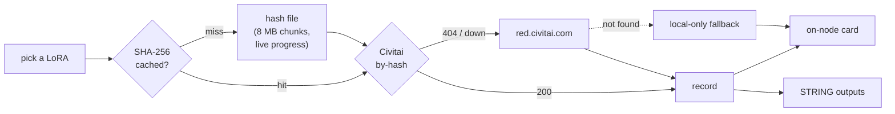

> 🌀 **Nougan Suite** · [← Back to overview](../README.md) · [All docs](./)

# Nougan Lora Inspector 🔍

```text
┌ NOUGAN · LORA INSPECTOR ──────────── hashing ▓▓▓▓▓░░ 62% ┐
│  Detail Additions            v2.0 · LORA · SafeTensor     │
│  TRIGGER WORDS   [ detail additions ]        [copy all]   │
│  FOR  ▮ Flux.2 ▮                                          │
│  ‹ [img] [img] [img] [img] [img] ›   ← click = copy prompt│
│  ⬇ 48,201   ★ 4.87   228 MB        civitai.com  open ↗   │
└───────────────────────────────────────────────────────────┘
```

**Point at a LoRA. It identifies itself.** Base model (Flux 2, Krea 2, LTXV, Pony…), trigger words, sample images, stats — pulled live from Civitai and rendered right on the node. No queue, no browser, no copy-paste archaeology through model pages.

`civitai.com` first, automatic fallback to `red.civitai.com`. Zero pip dependencies.

---

## At a glance

| | |
|---|---|
| **Node** | `Nougan Lora Inspector 🔍` (category `nougan`) |
| **Inputs** | none — everything is an on-node widget |
| **Outputs** | `model_name` · `base_model` · `trigger_words` · `metadata_json` (all `STRING`) |
| **Runs when** | you pick a LoRA, press **inspect**, or queue the prompt |
| **Needs** | nothing (API key optional, recommended) |

## Features

- 🔁 **No Queue required** — selecting a LoRA auto-inspects it (~0.4 s debounce); the **inspect** button re-runs, **↻** force-refreshes bypassing all caches.
- 🖼️ **Sample strip** — every image from the Civitai record, snap-scrolling left→right (arrows, trackpad, or mouse wheel).
- 📋 **Click an image → copies its positive prompt.** Green "prompt copied ✓" flash; amber "no prompt" if the image has no generation data — clipboard untouched.
- 🏷️ **Trigger words up top** — click a chip to copy it, or **copy all** for the comma-separated list.
- 🧬 **Base-model badge** — color-coded per architecture family so you know at a glance if a LoRA fits your checkpoint.
- 📊 **Stats & provenance** — downloads, rating, file size, format, SHA-256, and an `open ↗` link to the Civitai page.
- 🛟 **Graceful fallback** — hash not on Civitai (self-trained LoRAs) or network down? You still get local Kohya `ss_*` metadata from the safetensors header, flagged `local only`. The graph never crashes.
- 💾 **Persistent** — the card is stored in the workflow and re-renders on load; hashes and Civitai records are cached to disk.

## How it works



## Install

Already part of the **Nougan suite** — nothing extra to do:

1. Update the suite (`git pull` or re-copy).
2. Restart ComfyUI (the web extension loads at startup).
3. Confirm the console shows `[Nougan] ✅ Lora Inspector loaded.`

Files it adds:

```text
your-suite/
├── __init__.py                      ← registers the node in its own try/except
├── nougan_lora_inspector.py         ← node + /nougan/lora_inspector/inspect route
├── web/nougan-lora_inspector.js     ← panel, progress bar, sample strip
├── cache/lora_inspector_cache.json  ← created automatically
└── civitai_api_key.txt              ← optional, see below
```

> The node lives in its own `try/except` block — even if it fails to load, the core suite and every other optional node keep working.

## Usage

1. **Add Node → nougan → Nougan Lora Inspector 🔍**
2. Pick any LoRA from `models/loras` in the dropdown — it inspects itself immediately.
3. Read the card: trigger words, base model, samples, stats.
4. **Click a sample image** to copy the exact prompt that generated it.
5. Optionally wire the string outputs into prompt builders / text nodes — or leave them dangling; the node executes either way.

| Control | Action |
|---|---|
| LoRA dropdown | auto-inspects on change |
| **inspect** | manual lookup (uses cache) |
| **↻** | force refresh — re-hash + re-fetch, ignoring cache |
| sample image | copy that image's positive prompt |
| trigger chip | copy one trigger word |
| **copy all** | copy all trigger words, comma-separated |
| ‹ › / wheel | scroll the sample strip |
| `open ↗` | open the Civitai page |

## API key (optional)

Unauthenticated requests work, but a key gets you higher rate limits and full NSFW records. Resolution order:

1. The node's `api_key` widget
2. `CIVITAI_API_TOKEN` (or `CIVITAI_API_KEY`) environment variable
3. `civitai_api_key.txt` in the suite root — one line, just the token

Get a token from [civitai.com → Account Settings → API Keys](https://civitai.com/user/account).

## Caching

| What | Where | Bypass |
|---|---|---|
| SHA-256 per file (keyed by path + mtime + size) | `cache/lora_inspector_cache.json` | **↻** |
| Civitai record per hash | same file | **↻** |

First hash of a ~200 MB LoRA takes a few seconds; every lookup after that is near-instant. Delete the cache file for a clean slate.

## For scripters — HTTP endpoint

The node's button talks to a plain endpoint you can call from anything:

```text
GET /nougan/lora_inspector/inspect
```

| Param | Required | Description |
|---|---|---|
| `lora` | ✅ | filename inside `models/loras` |
| `source` | | `auto` (default) · `civitai.com` · `red.civitai.com` |
| `api_key` | | bearer token override |
| `node` | | node id — websocket progress events target it |
| `force` | | `1` to bypass caches |

```bash
curl "http://127.0.0.1:8188/nougan/lora_inspector/inspect?lora=my_lora.safetensors&node=12"
```

Returns the full payload (`model_name`, `base_model`, `trigger_words`, `images[]` with per-image `meta`, `stats`, …). Progress streams over the websocket as `nougan_lora_inspector/progress`, `…/metadata`, and `…/error` events.

## Troubleshooting

| Symptom | Fix |
|---|---|
| Card says `local only` | Hash isn't on Civitai (self-trained / renamed files) — local safetensors metadata is still shown |
| `auth rejected (401/403)` | Bad or expired API key — see resolution order above |
| Panel never appears | Check console for `[Nougan] ⚠️ Lora Inspector NOT loaded …` and restart ComfyUI |
| Stale record after re-uploading | Press **↻**, or delete `cache/lora_inspector_cache.json` |
| Sample images blank | Civitai CDN hiccup / hotlink block — broken frames hide themselves; the rest of the card is unaffected |
| `.ckpt` LoRA | Hashing + Civitai lookup work; there's no safetensors header, so local metadata is empty |

---

*Queries the public [Civitai API](https://github.com/civitai/civitai/wiki/REST-API-Reference) (`/api/v1/model-versions/by-hash/{sha256}`). Not affiliated with Civitai.*

---

> 🌀 **Nougan Suite** · [← Back to overview](../README.md) · [Core nodes](core-nodes.md) · [Regional LoRA](regional-character-lora.md) · [Prompt Relay](prompt-relay.md) · [LM Studio Bridge](lm-studio-bridge.md)
